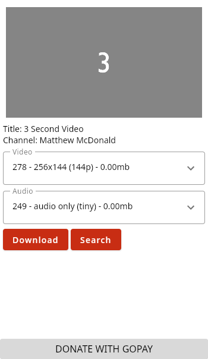

# YTDL DESKTOP


> ytdlDesktop is youtube downloader app, this app can download video youtube and another website like ([bilibili.com](https://www.bilibili.com/) and etc.) build with jetpack compose and ktor. extractor video using [ytdl](https://github.com/ytdl-org/youtube-dl)

### screenshot application



### build from source code

```bash
    git clone https://github.com/nursyah21/ytdlDesktop.git
    cd ytdlDesktop
    ./gradlew packageDistributionForCurrentOS
```
